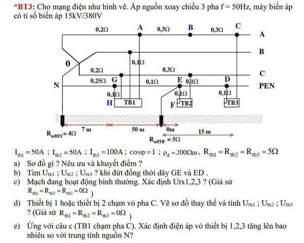
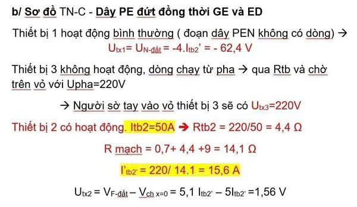
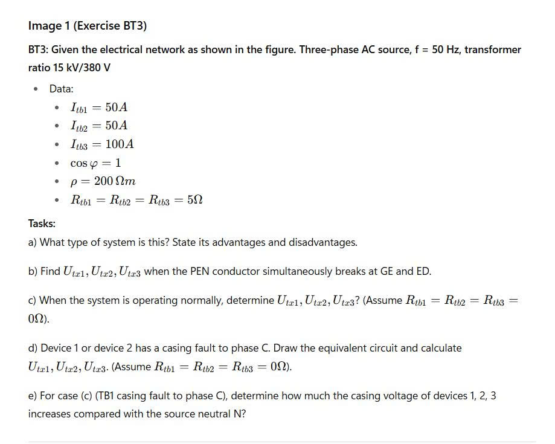
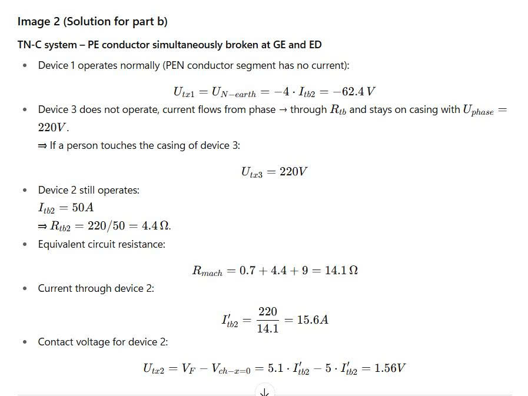

# Nam's homework at the Tôn Đức Thắng University

Solving homeworks with Nam Nguyễn of the Tôn Đức Thắng University in Saigon.

## 2025/09/27 Broken PEN conductor in a system with 3 devices

Solution in a Jupyter notebook:

> [File in Google Colaboratory](https://colab.research.google.com/drive/1uV5ceeU2U_ZtXH21PM6EcFd4qzqG1tay?usp=sharing)
